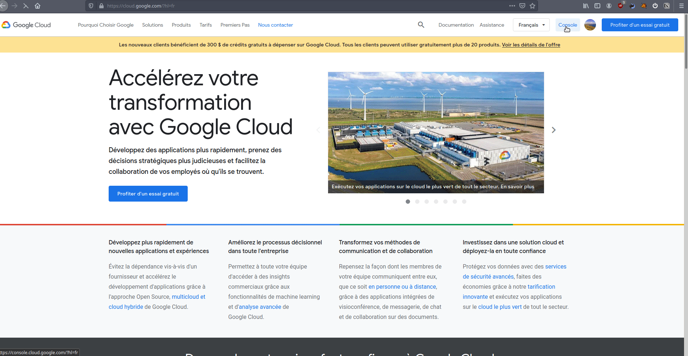
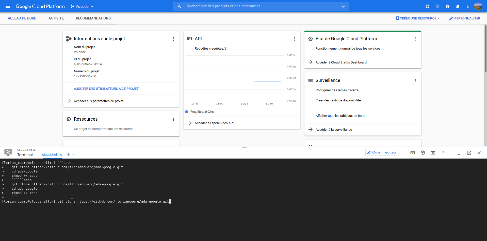
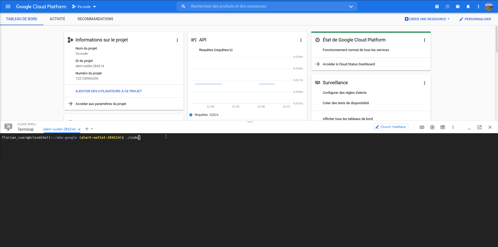

# Ada sur google cloud platform

## Quick start guide

1. Créer un compte sur [google cloud platform](https://cloud.google.com/?hl=fr)

2. Lancer le cloud shell  

3.  Taper ces commandes ```
   git clone https://github.com/floriancuerq/ada-google.git 
   cd ada-google
   chmod +x code ```
   
   
4. Lancer le programme avec la commande ```./code```

5. Récupérer le mot de passe puis se rendre sur la page de vs code 

   

   

   

   

   
